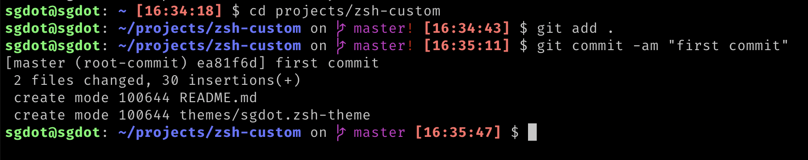

# Install

[Overriding and adding zsh themes](https://github.com/ohmyzsh/ohmyzsh/wiki/Customization#overriding-and-adding-themes)

# Theme sgdot

This theme requires the font [FiraCode](https://github.com/tonsky/FiraCode)

